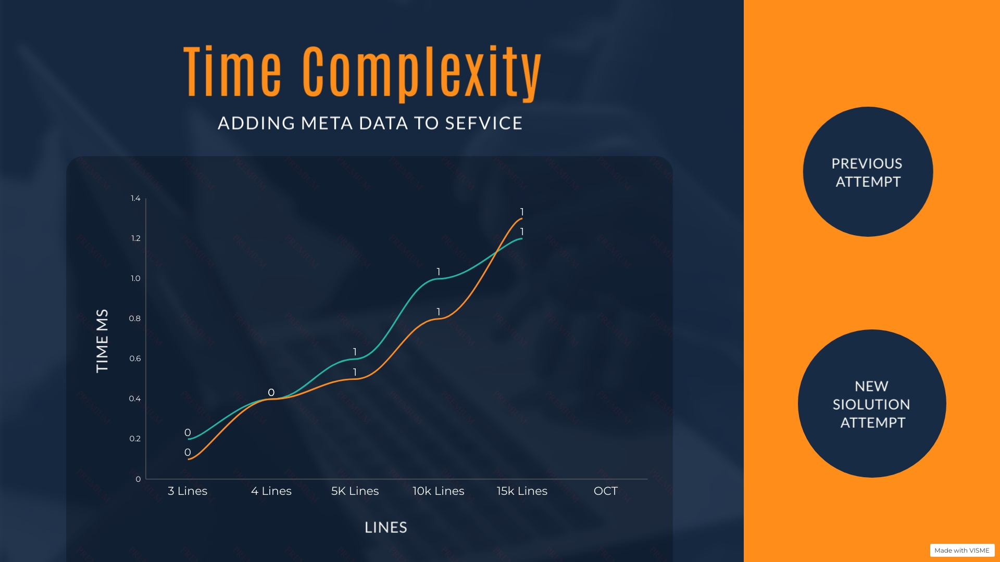
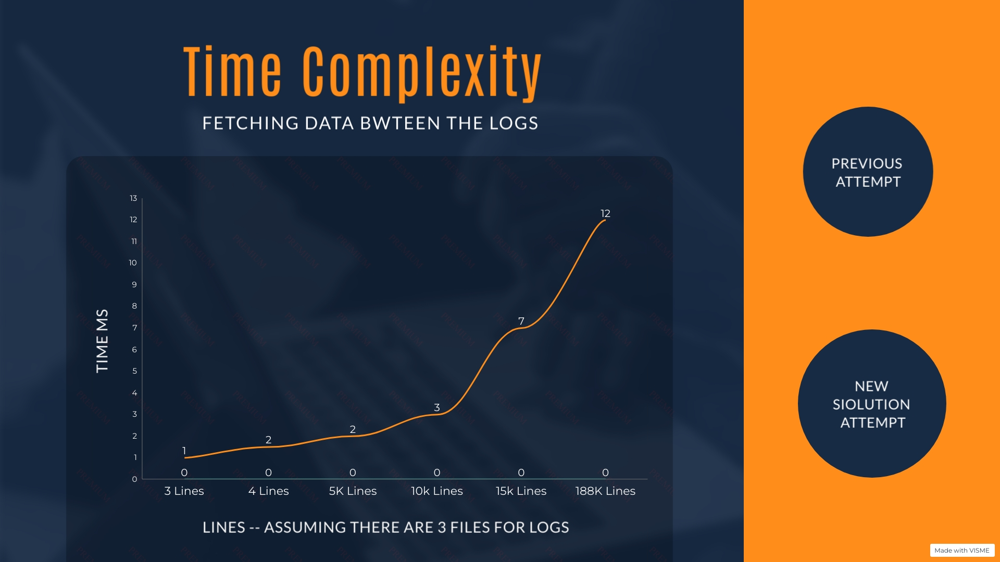
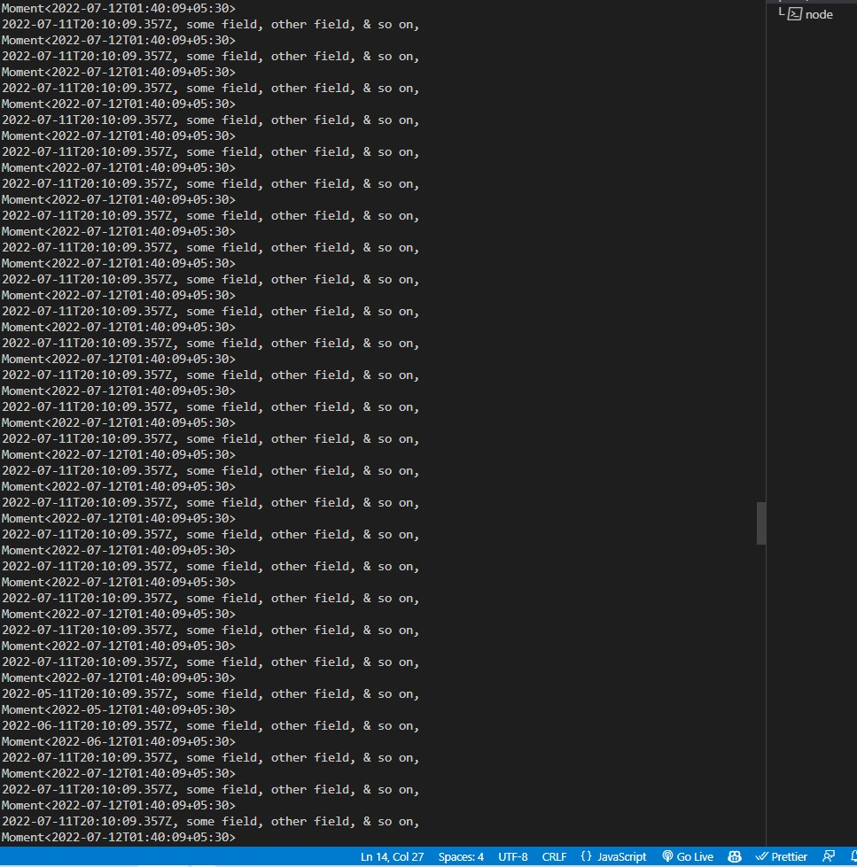
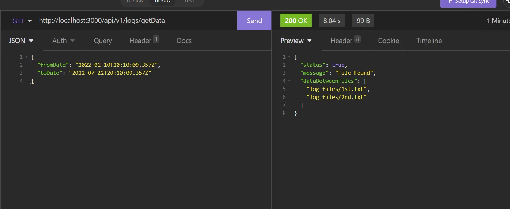

# Achieve AI Follow-Up Assignment 
### Earlier Submission
In the Last Solution i assumed that the Logs are stored in a global database where I can access there name and path in the form of an array. <br>
That's why I thought of creating a service that will create metadata in the form of "Cronjob" which will take snapshots at regular intervals of time and will update the time series accordingly. And the second service will be used to fetch data.
This submission was returning the file names where all the data is present. According to me the following were be the key aspects for the submisson.<br>
There were two services inovolved
- PostMeta Data
- Fetch Data: 

### PostMeta Data
This Service will be used to fetch the meta data from the given logs present in the database and some interval of time. Let say it is __10 minutes__. This means that it will update the database after every 10 minutes.
> Note: This will not update the whole database instead it will just update the newly created logs and store its meta data values in the database. <br>

In the problem statement it was given to assume 286TB of data and it is devided into 16GB segments that means there are roughly around __16000__ log files according to the question.And the time complexity that will take to add all log files  will be around... <br>
> Time Complexity : O(n) where n is the number of log files. <br>

Returns an object which says that the data is posted
```bash
{   
	
	"status": true,
	"message": "Logs Meta Data Saved Successfully"
}
```

I thought since i am taking the first and last line it will not impact the time/memory complexity for the solution. 

### Fetch Data
This service will be used to fetch the data which the user has demanded from the metadata. These service application devided into following steps
- Fetch user's "from and to" date and call the check the time series Database which was created by the first service.
- Check which data lies between the two dates provided by the user and give reponse of two files which says that data is present between these two files
>Time Complexity: O(n) where n is the number of log files
Returns two files where the data is present
```bash
{
	"status": true,
	"message": "File Found",
	"dataBetweenFiles": [
		"log_files/1st.txt",
		"log_files/2nd.txt"
	]
}
```
### Problems with this approach
- Since I am returning the files  it misses out the point for the solution where we have to 
return the whole data
- Memory Consumption can be the issue where I am storing both first and last line. I think there will be no issue storing the first line but there can be some issue where we have to store the last line as the whole file is loaded to get the last line

### Why I Didn't used Binary search
I didn't used Binary search as we are only given with the name and size of the file. Inorder to calculate the mid element we have to first find the last line to get the number of lines in the logs. Which will also take O(n) time. Rather than that we can do a linear scan for searching.

### Changes in Code
- Intead of storing the first and last date of the file. Now I am only storing the frst line and can find data between these segments.
- Now After getting the files I am doing a linear scan till the end of the file to traverse all the data user demanded.
- If the data is present locally i think we can create another module which will run in backend to first add and collect the metadata and then all the search should be performed.



> Earlier I dodn't showed the Data present in between two files. But now after computing it through Linear Scan it is giving me this. Here Green is the previous attempt and orange is the new attempt<br><br>


### After SuccessFull Completion These are the outputs of the code

> This is the data we are getting from it. It took almost 8 seconds to process answer as this file is huge consisting of almost 188K lined information



## Thank you so much for your assignment. Really learned a lot during this project ☺☺.
